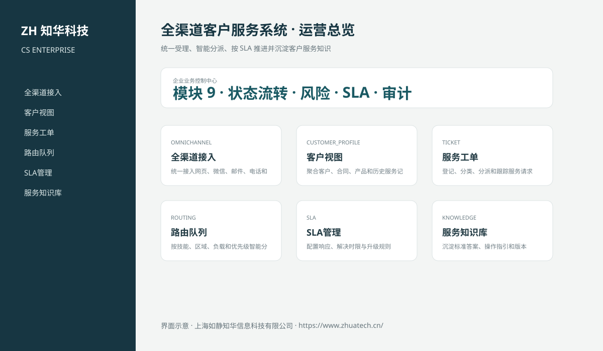
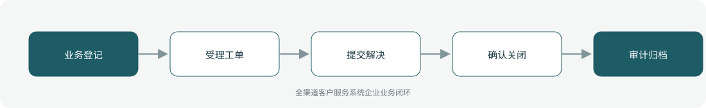

# ZhuaTech CS｜全渠道客户服务系统

> 统一受理、智能分派、按 SLA 推进并沉淀客户服务知识

ZhuaTech CS 是知华科技（上海如静知华信息科技有限公司）发布的企业级源码项目，面向“全渠道会话、客户档案、工单、路由、SLA、升级、知识库、质检与满意度”提供管理端与响应式业务端。工程采用前后端分离架构，所有示例数据均为虚构数据。

[知华科技官网](https://www.zhuatech.cn/) · [架构说明](docs/ARCHITECTURE.md) · [API 文档](docs/API.md) · [企业能力](docs/ENTERPRISE.md) · [测试说明](docs/TESTING.md)



## 业务模块

| 模块 | 核心能力 |
| --- | --- |
| 全渠道接入 | 统一接入网页、微信、邮件、电话和API |
| 客户视图 | 聚合客户、合同、产品和历史服务记录 |
| 服务工单 | 登记、分类、分派和跟踪服务请求 |
| 路由队列 | 按技能、区域、负载和优先级智能分配 |
| SLA管理 | 配置响应、解决时限与升级规则 |
| 服务知识库 | 沉淀标准答案、操作指引和版本 |
| 服务质检 | 执行抽检、评分、申诉与改进 |
| 客户满意度 | 采集评价、回访和负面反馈 |
| 服务分析 | 分析渠道、效率、一次解决率和趋势 |



## 企业级控制

- ADMIN / OPERATOR 角色边界和管理员接口隔离；
- 服务端字段、模块、唯一编号和状态迁移校验；
- 组织、期间、责任人、风险等级、到期日和 SLA 统计；
- 幂等创建、JPA 乐观锁、重复提交保护和职责分离；
- 附件 SHA-256 元数据、业务凭证完整性与全流程审计；
- 组合检索、分页、逾期筛选、UTF-8 CSV 导出和协作时间线；
- 外部系统仅预留适配器，使用方自行配置地址与凭据；
- prod profile 拒绝默认密码、弱数据库口令和本地跨域来源。

## 技术架构

- 后端：Java 21、Spring Boot、Spring Security、JPA、Bean Validation、Actuator
- 前端：Vue 3、Vite、Axios，支持桌面端与移动端响应式布局
- 数据库：MySQL 8；自动化测试使用 H2
- 交付：Docker Compose、Nginx、环境变量、GitHub Actions
- Java 包名：`cn.zhuatech.customerservice`

## 启动与测试

```bash
cd backend && mvn test
cd ../frontend && npm install && npm run build
cd .. && cp .env.example .env && docker compose up --build
```

开发演示账号：`admin / admin123`、`operator / operator123`。生产环境必须通过环境变量替换全部默认凭据。

## 许可与商业授权

Copyright © 2026 上海如静知华信息科技有限公司。

本工程仅允许个人学习、研究和非商业技术交流，**不得用于商业用途**。企业内部使用、生产部署、SaaS运营、项目交付、品牌替换、收费培训、咨询实施或再分发，均须事先获得上海如静知华信息科技有限公司书面授权，详见 [LICENSE](LICENSE)。

深度开发、私有化部署、系统集成与企业数字化咨询，请访问[知华科技官网](https://www.zhuatech.cn/)或扫码联系：

| 微信咨询一 | 微信咨询二 |
| --- | --- |
|  |  |

SEO：全渠道客户服务系统、CS系统源码、企业数字化、Java企业系统、Vue管理系统、知华科技、上海如静知华信息科技有限公司。

## V2.0 专业领域能力

新增客户、服务工单、内外部沟通消息和知识文章模型。SLA按P1–P4或自定义时限计算，支持自动升级；工单必须具备客户可见回复后才能解决，并支持确认关闭和七日内重开。知识文章执行草稿、审核、管理员发布流程。专业API根路径为 `/api/service`。
